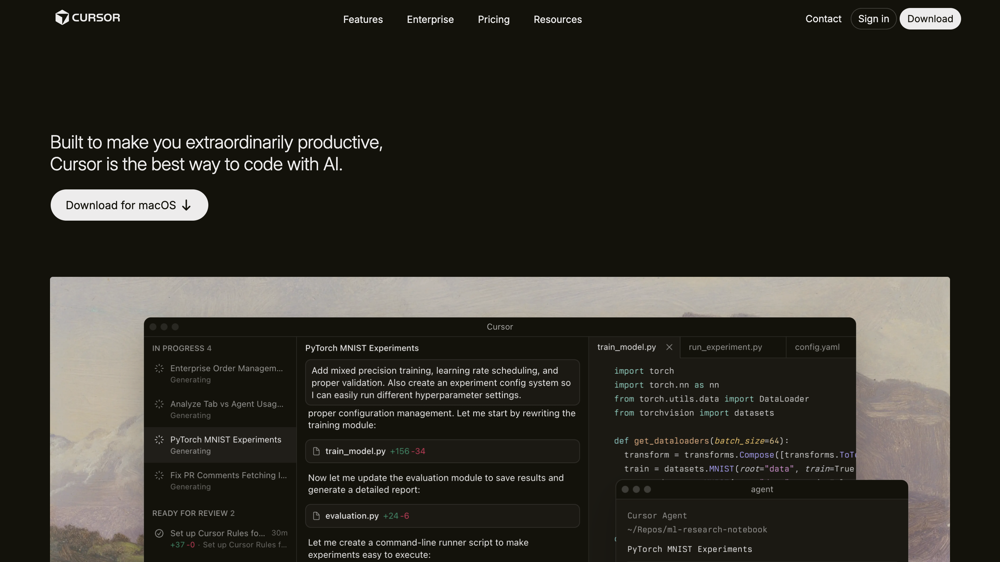
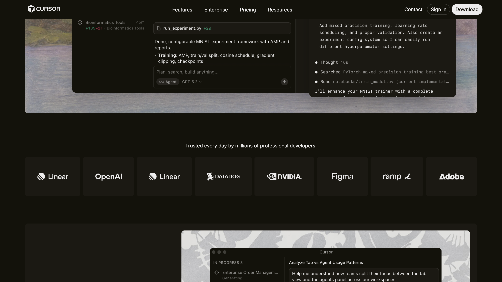
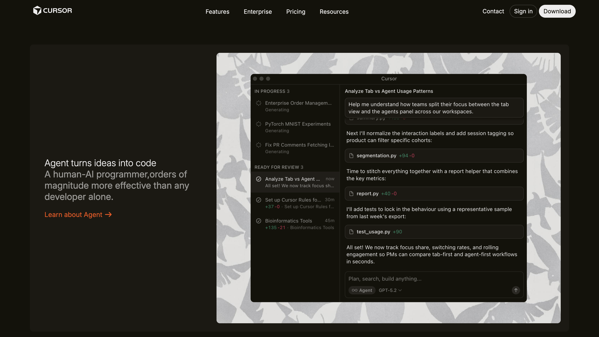
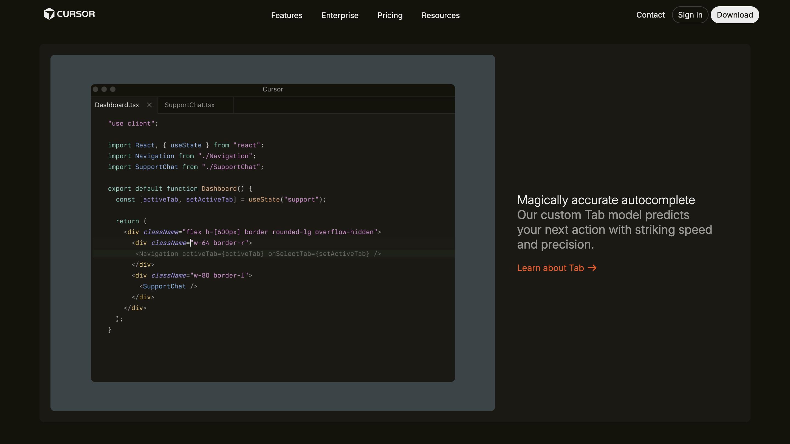
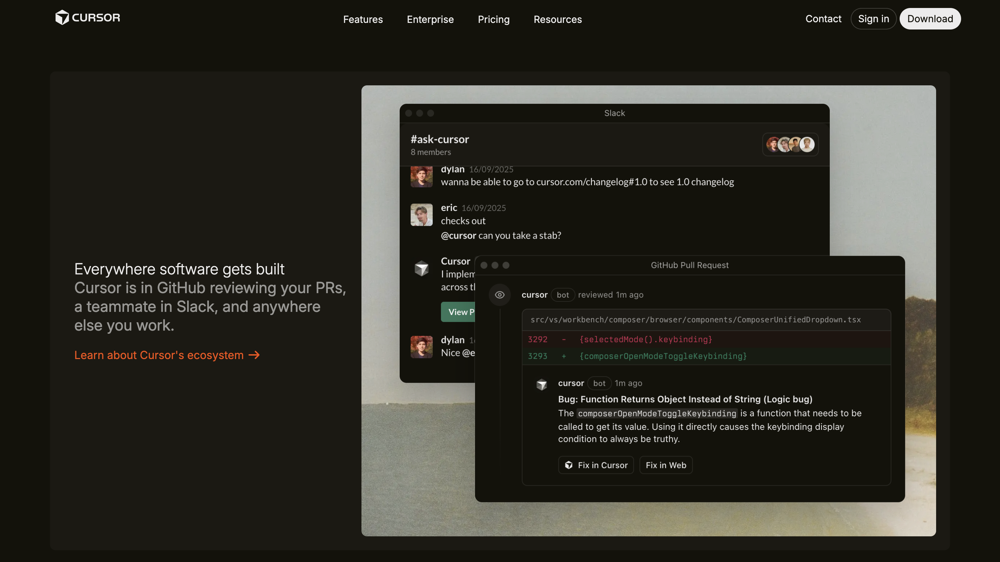
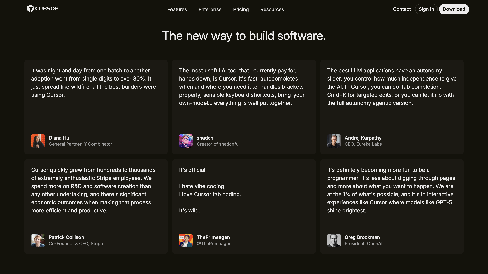
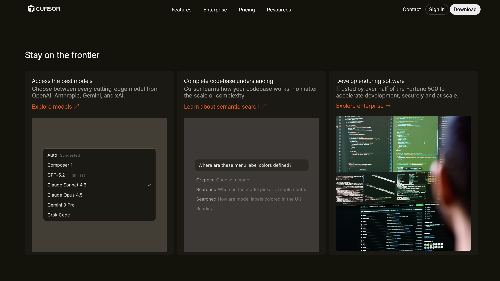
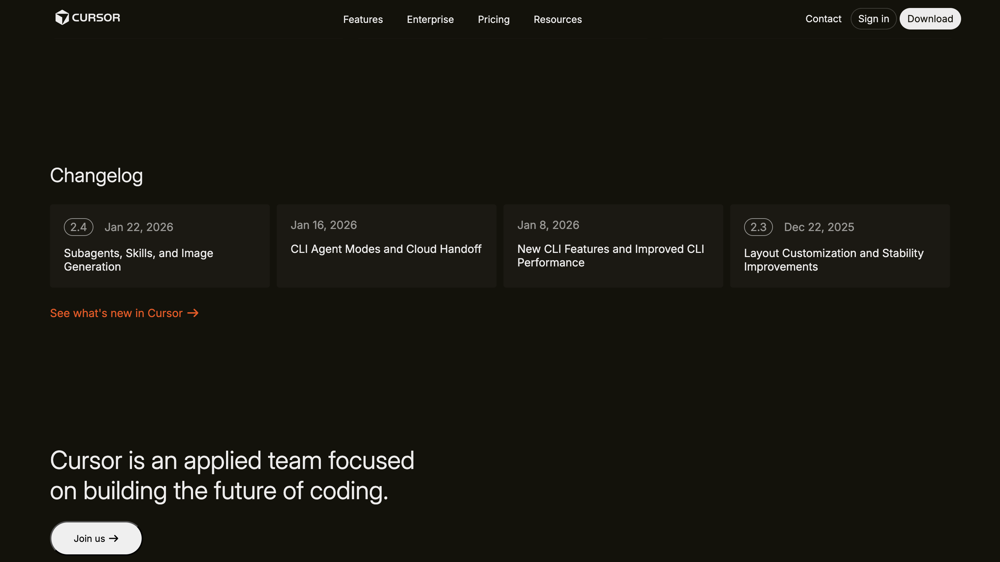
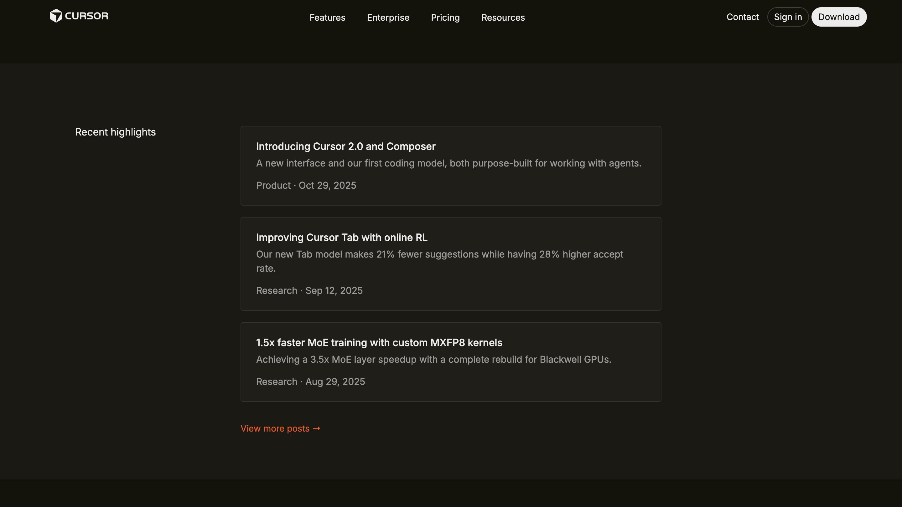
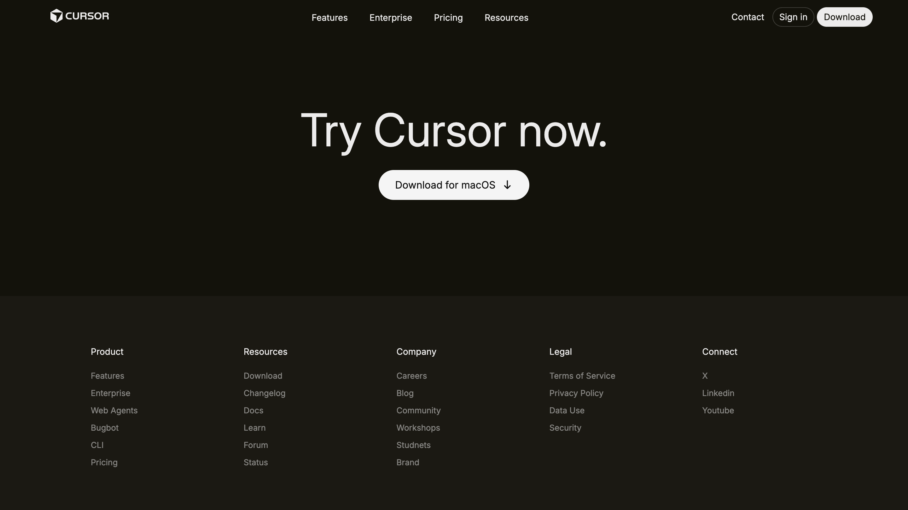

# cohort-cursor-final-clone
# 🚀 Cohort Cursor Clone

A sleek **desktop-only clone** of the Cursor website built using pure **HTML & CSS**.  
This project was created to practice modern UI layouts, clean spacing, and professional frontend structure.

🌐 **Live Website:**  
👉 https://parth-cursor-clone.netlify.app  

---

## ✨ Features

✅ Cursor-inspired modern UI  
✅ Built with only HTML & CSS  
✅ Desktop optimized layout  
✅ Clean visual hierarchy  
✅ Organized assets  
✅ Deployed on Netlify  

---

## 🛠 Tech Stack

- HTML5  
- CSS3  
- Netlify (Hosting)

---

## 🖥 Website Preview

### Homepage



---

### UI Sections

  
  


---

### Layout Details

  
  


---

### More Views

  
  
  


---

## 🎯 Purpose of This Project

This project helped me learn:

- Professional website cloning  
- CSS layouts & positioning  
- UI spacing & alignment  
- Asset management  
- Static site deployment  
- Real frontend workflow  

---

## ⚠️ Important Notes

🔹 Desktop only (not responsive yet)  
🔹 Educational project  
🔹 Design credits belong to **Cursor**

---

---

## 🚀 Run Locally

```bash
git clone https://github.com/your-username/cohort-cursor-clone.git
